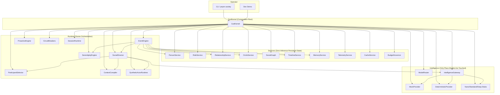

# GrokBot Society

> **A provider-neutral runtime for persistent synthetic people, roles, relationships, circles and social worlds—designed so population is cheap and intelligence is invoked only when interaction actually requires it.**

Website: [https://grokbot-society.vercel.app](https://grokbot-society.vercel.app)

---

## What is GrokBot Society?

GrokBot Society is a runtime for building **persistent social worlds** populated by synthetic people who remember, relate, and evolve—without burning money on continuous LLM calls.

The central insight:

```
cost ≈ meaningful generated interaction
```

not

```
cost ≈ population × relationships × time
```

In the 5,000-person simulator profile, 15 people are active and 4,985 are dormant. Only selected participants enter model context, so dormant population adds $0.

---

## Central Equation

```
PERSON ≠ ROLE ≠ ACTOR ≠ MODEL ≠ GROKBOT
```

| Concept | What it is | What it is NOT |
|---------|------------|----------------|
| **Person** | Durable canonical identity (biography, personality, interests, social graph) | An agent, a model, a prompt |
| **Role** | Reusable trait/capability set (friend, mentor, wildcard…) | An agent; assigning a role creates zero inference |
| **Actor** | Ephemeral per-scene persona materialized from Person + Roles + Relationships + Memory | Persistent; dies when the scene ends |
| **Model** | Capability class (`social.mock` → `nano` → `standard` → `deep`) | A person; routes are swapped without touching identity |
| **GrokBot** | Optional premium inference source (a route, not an identity) | Required; the runtime works at $0 without one |

---

## Economic Architecture

| Traditional agent swarms | GrokBot Society |
|--------------------------|-----------------|
| One call per character per message | **One call per multi-character scene** |
| Continuous background simulation | **Zero inference at rest** |
| Unbounded context growth | **Bounded context (≤3 speakers, ≤12k tokens)** |
| Silent retries on failure | **Fail closed: deterministic fallback, no retry loops** |
| Provider lock-in | **Provider-neutral routing; swap models without touching persons** |
| Hive-mind knowledge | **Privacy scopes: private / person-user-shared / circle / public** |

---

## Key Ideas

- **Persistent synthetic people** — Durable identities with biography, personality, interests, mood
- **Composable social roles** — 29 seeded roles (friend, mentor, wildcard, travel_companion…) assigned at zero cost
- **Social circles** — Communities with membership, order, and circle-scoped memory/relationships
- **Relationship evolution** — 7-dimension state with inertia (`stranger → acquaintance → friend → close_friend → best_friend → romantic_interest → partner → spouse`)
- **Memory boundaries** — HOT (recent) / WARM (retrievable) / COLD (archived) tiers with privacy scopes
- **Lazy world simulation** — No continuous loop; events drive everything
- **Deterministic social orchestration** — Participant selection, context compilation, and validation are pure code
- **One-call multi-character scenes** — Up to 3 speakers in a single structured generation
- **Provider-neutral routing** — Mock → nano → standard → deep; GrokBot is optional
- **Bounded context** — Hard speaker cap, token budget, circuit breakers
- **Hard usage budgets** — Per-event, hourly, daily ceilings; kill switch blocks all inference

---

## Quick Start

```bash
# Clone and install
git clone https://github.com/M4G3LL4N0/grokbot-society.git
cd grokbot-society
pnpm install

# Verify the build
pnpm typecheck
pnpm test

# Boot a live society (in-memory, $0 mock provider)
pnpm dev

# Or use the operator CLI with a persistent database
pnpm society start --db ./my-society.db
pnpm society status --db ./my-society.db
pnpm society people --db ./my-society.db
pnpm society chat "Anyone up for a hike this weekend?" --circle <INNER_CIRCLE_ID> --db ./my-society.db
```

### What `pnpm dev` does

1. Boots an in-memory society with 5 demo persons, 29 roles, 11 circles
2. Runs one group scene on `MockProvider` (zero cost)
3. Prints the scene: 3 speakers, 1 model call, 2 timeline/relationship writes, $0 total

### What `pnpm society` gives you

```
society — local synthetic society CLI

usage: society <command> [args]

  start [--db <path>]                boot society (idempotent seed on first run)
  status                             society + model + cache state
  people                             list persons
  person <name-or-id>                identity card + relationships + landmarks + timeline
  roles                              role registry (roles create zero agents)
  circles                            circles + members
  events                             recent events
  chat "<message>" [--circle <id>]   talk to the society (one bounded scene)
  chat                                interactive REPL
  budget                             budget governor state
  usage                              telemetry: spend per person/circle/provider
  simulate                           cost simulator (5 / 50 / 500 / 5000 people)
  proactive [--circle <id>]          run one explicit proactive tick
  session start|end <id>|context <id>  long-session abstraction
  landmarks <name-or-id>             shared-history stores
  identity <name-or-id>              debug: compact identity card
  debug <name-or-id>                 debug: bounded actor context for one person
  pause / resume                     pause/resume the society
  kill / unkill                      fail-closed kill switch (blocks ALL inference)
  close                              close the db cleanly
```

---

## Architecture Diagram



---

## Cost Safety

```
CACHE
    ↓ (hit → return, $0)
STATE / DB LOOKUP
    ↓
RELEVANCE SCORING (deterministic)
    ↓
PARTICIPANT SELECTION (max 3 speakers)
    ↓
CONTEXT COMPILATION (BASELINE + DELTA + EVENT, ONLY selected persons)
    ↓
BUDGET DECISION (fail closed)
    ↓
AT MOST ONE GENERATION REQUEST
    ↓
DETERMINISTIC OUTPUT VALIDATION (no LLM judging LLM)
    ↓
PERSISTENCE (timeline, memory, relationships, followups, serendipity, telemetry)
```

**Ladder used to resolve any cognitive task:**

```
CACHE → STATE → DETERMINISTIC → DB/SCRIPT → CHEAP → CHATGPT → GROK
```

- Most scenes stop rungs before a GrokBot is ever asked
- Background/scheduled followups default to **zero** inference (`backgroundModelCalls = 0`)
- `maxCallsPerEvent = 1` — one event = at most one model call
- `maxRetries = 0`, `recursionDepth = 0` — no retry loops, no nested inference
- Kill switch: every gateway `generate` fails closed (`KillSwitchError`) → deterministic fallback

---

## Tests

Run with `pnpm test` (vitest) and `pnpm typecheck` (tsc `--noEmit`).

**Result: 42/42 pass across 8 files. Typecheck clean.**

### The 14 Required Proofs

| # | Proof | File | Verdict |
|---|-------|------|---------|
| 1 | Creating 1,000 Persons makes zero model calls | `tests/01.mass-zero-cost.test.ts` | ✅ PASS |
| 2 | Assigning 1,000 Roles makes zero model calls | `tests/01.mass-zero-cost.test.ts` | ✅ PASS |
| 3 | Creating 100 Circles makes zero model calls | `tests/01.mass-zero-cost.test.ts` | ✅ PASS |
| 4 | Adding thousands of relationships makes zero model calls | `tests/01.mass-zero-cost.test.ts` | ✅ PASS |
| 5 | Idle elapsed time → zero model calls | `tests/02.idle-dormant.test.ts` | ✅ PASS |
| 6 | Dormant state → zero inference, no manufactured serendipity | `tests/02.idle-dormant.test.ts` | ✅ PASS |
| 7 | 3-person scene → at most ONE model request | `tests/03.scenes.test.ts` | ✅ PASS |
| 8 | Only selected participants enter model context | `tests/03.scenes.test.ts` | ✅ PASS |
| 9 | Silence is valid (no eligible → no inference, no fake chatter) | `tests/03.scenes.test.ts` | ✅ PASS |
| 10 | Never activates everyone: 10-member circle → ≤ 3 speakers | `tests/03.scenes.test.ts` | ✅ PASS |
| 11 | Canonical identity survives provider switching | `tests/04.identity-switching.test.ts` | ✅ PASS |
| 12 | Kill switch blocks all model calls (fail closed) | `tests/05.guards.test.ts` | ✅ PASS |
| 13 | Budget limit blocks calls beyond `maxCallsPerEvent` | `tests/05.guards.test.ts` | ✅ PASS |
| 14 | Recursion is impossible (`recursionDepth = 0`) | `tests/05.guards.test.ts` | ✅ PASS |

### Architectural Guarantees

| Guarantee | File | Verdict |
|-----------|------|---------|
| Provider calls outside `IntelligenceGateway` are impossible | `tests/06.architectural-block.test.ts` | ✅ PASS |
| Unavailable model class fails closed, never falls back to paid | `tests/05.guards.test.ts` | ✅ PASS |
| Background/scheduled followups run with zero inference | `tests/07.end-to-end.test.ts` | ✅ PASS |

### Domain Proofs

| Behavior | File | Verdict |
|----------|------|---------|
| Relationship inertia (one interaction ≠ spouse) | `tests/07.end-to-end.test.ts` | ✅ PASS |
| Knowledge privacy (private/circle/public scopes, no omniscient hive mind) | `tests/07.end-to-end.test.ts` | ✅ PASS |
| Intelligence cache reuses identical requests ($0, no second call) | `tests/07.end-to-end.test.ts` | ✅ PASS |
| MockProvider boots → chats → remembers → befriends → schedules end-to-end | `tests/07.end-to-end.test.ts` | ✅ PASS |

### Society MVP Proofs (Extended)

| Behavior | File | Verdict |
|----------|------|---------|
| Seed idempotency (re-run start = no duplicates) | `tests/08.society-mvp.test.ts` | ✅ PASS |
| Deterministic bounded actor context | `tests/08.society-mvp.test.ts` | ✅ PASS |
| Roles/circles/entity routes never create agents | `tests/08.society-mvp.test.ts` | ✅ PASS |
| One-call-per-scene at $0 | `tests/08.society-mvp.test.ts` | ✅ PASS |
| Session rolling-window bounds | `tests/08.society-mvp.test.ts` | ✅ PASS |
| Landmark pair dedupe | `tests/08.society-mvp.test.ts` | ✅ PASS |
| Proactive disabled/NO_ACTION/REACH with budget+cooldown | `tests/08.society-mvp.test.ts` | ✅ PASS |
| Circuit breakers (event explosion, context overflow, fan-out) | `tests/08.society-mvp.test.ts` | ✅ PASS |
| Cost simulator dormant profile (5,000 people = ~$0) | `tests/08.society-mvp.test.ts` | ✅ PASS |
| Usage telemetry (blockedCalls, spend per dimension) | `tests/08.society-mvp.test.ts` | ✅ PASS |
| Disabled bridges (SocialCore, ChatGPT) | `tests/08.society-mvp.test.ts` | ✅ PASS |
| Pause/resume + kill switch deterministic fallback | `tests/08.society-mvp.test.ts` | ✅ PASS |
| Restart persistence via file DB | `tests/08.society-mvp.test.ts` | ✅ PASS |

---

## Roadmap

### ✅ DONE (v0.1)
- Provider-neutral runtime with mock/deterministic/remote-stub providers
- Person/Role/Relationship/Circle/SocialGraph engines
- EventEngine + SocialDirector + bounded SceneRenderer
- SyntheticActor runtime + HOT/WARM/COLD memory
- Proactive engine (disabled by default, conservative)
- Sessions (rolling-window context)
- CostSimulator + CircuitBreakers + BudgetGovernor + kill switch
- ChatGPT/SocialCore bridge contracts (disabled)
- Operator CLI + 42 tests + typecheck clean
- God/GrokBot handoff package

### 🔄 NEXT (v0.2)
- Real provider integrations (nano/standard/deep) behind feature flags
- WebSocket server for real-time society observation
- Persistence benchmarks (10k+ persons)
- Structured logging / OpenTelemetry
- Admin API for society management

### 🧪 EXPERIMENTAL (v0.3+)
- Multi-society federation
- Learned relevance models (still provider-neutral)
- Visual society inspector
- Plugin system for custom event types

---

## Documentation

- [`ARCHITECTURE.md`](ARCHITECTURE.md) — Full pipeline, layers, and invariants
- [`docs/CONCEPTS.md`](docs/CONCEPTS.md) — Core concept definitions
- [`docs/GOD.md`](docs/GOD.md) — God as deterministic kernel, not super-agent
- [`docs/ROLES.md`](docs/ROLES.md) — Composable role architecture
- [`docs/SOCIETY_GRAPH.md`](docs/SOCIETY_GRAPH.md) — People, circles, relationships
- [`docs/COST_MODEL.md`](docs/COST_MODEL.md) — Why population stays cheap
- [`docs/MEMORY.md`](docs/MEMORY.md) — HOT/WARM/COLD + privacy scopes
- [`docs/PROVIDERS.md`](docs/PROVIDERS.md) — Provider abstraction & identity survival
- [`docs/GROKBOT_INTEGRATION.md`](docs/GROKBOT_INTEGRATION.md) — Optional premium infrastructure
- [`docs/CHATGPT_INTEGRATION.md`](docs/CHATGPT_INTEGRATION.md) — External intelligence service
- [`docs/SECURITY_AND_PRIVACY.md`](docs/SECURITY_AND_PRIVACY.md) — Memory isolation, credentials, boundaries
- [`docs/ROADMAP.md`](docs/ROADMAP.md) — Current reality vs future vision
- [`handoff/god-grokbot/`](handoff/god-grokbot/) — Minimal God operating package

---

## Disclaimer

**GrokBot Society is an independent open-source project.** It is not affiliated with, endorsed by, or connected to xAI, Grok, Cursor, or any other company. "GrokBot" in this project refers to an optional internal inference route name only.